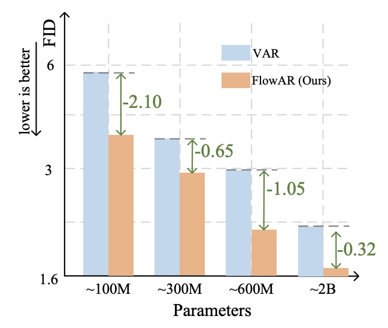

# FlowAR

[](https://arxiv.org/abs/2412.15205)&nbsp;
[](https://paperswithcode.com/sota/image-generation-on-imagenet-256x256?flowar-scale-wise-autoregressive-image)
[](https://huggingface.co/OliverRen/FlowAR)&nbsp;

This repository is the official implementation of [FlowAR: Scale-wise Autoregressive Image Generation Meets Flow Matching](https://arxiv.org/abs/2412.15205) 

### 🎉FlowAR is accepted by ICML2025!


## Introduction
Autoregressive (AR) modeling has achieved remarkable success in natural language processing by enabling models to generate text with coherence and contextual understanding through next token prediction. Recently, in image generation, VAR proposes scale-wise autoregressive modeling, which extends the next token prediction to the next scale prediction, preserving the 2D structure of images. However, VAR encounters two primary challenges: (1) its complex and rigid scale design limits generalization in next scale prediction, and (2) the generator's dependence on a discrete tokenizer with the same complex scale structure restricts modularity and flexibility in updating the tokenizer. To address these limitations, we introduce FlowAR, a general next scale prediction method featuring a streamlined scale design, where each subsequent scale is simply double the previous one. This eliminates the need for VAR's intricate multi-scale residual tokenizer and enables the use of any off-the-shelf Variational AutoEncoder (VAE). Our simplified design enhances generalization in next scale prediction and facilitates the integration of Flow Matching for high-quality image synthesis. We validate the effectiveness of FlowAR on the challenging ImageNet-256 benchmark, demonstrating superior generation performance compared to previous methods.



Compared to the closely related VAR, FlowAR provides superior image quality at similar model scales. For example, FlowAR-L, with 589M parameters, achieves an FID of 1.90—surpassing both VAR-d20 (FID 2.95) of comparable size and even largest VAR-d30 (FID 1.97), which has 2B parameters. Furthermore, our largest model, FlowAR-H (1.9B parameters, FID 1.65), sets a new state-of-the-art benchmark for scale-wise autoregressive image generation.
## Preparation

We adopt the tokenizer from [MAR](https://github.com/LTH14/mar) and put it in /path/to/MAR/vae

Download ImageNet dataset.

## Training
Keep overall batch size of 2048. 

Train FlowAR-S
```python
torchrun --nproc_per_node=8 --nnodes=4 --node_rank=$WORKER_ID --master_addr=$WORKER_0_HOST --master_port=$WORKER_0_PORT \
main_flowar.py \
--img_size 256 --vae_path /path/to/MAR/vae/kl16.ckpt --vae_embed_dim 16 --vae_stride 16 --patch_size 1 \
--model flowar_small --diffloss_d 2 --diffloss_w 1024 \
--epochs 400 --warmup_epochs 100 --batch_size 64 --blr 5e-5 \
--output_dir ./output_dir/ --resume ./output_dir/ \
--data_path /path/to/imagenet/ --cached_path /path/to/imagenet_feature/
```
Train FlowAR-L
```python
torchrun --nproc_per_node=8 --nnodes=4 --node_rank=$WORKER_ID --master_addr=$WORKER_0_HOST --master_port=$WORKER_0_PORT \
main_flowar.py \
--img_size 256 --vae_path /path/to/MAR/vae/kl16.ckpt --vae_embed_dim 16 --vae_stride 16 --patch_size 1 \
--model flowar_large --diffloss_d 12 --diffloss_w 1024 \
--epochs 400 --warmup_epochs 100 --batch_size 64 --blr 5e-5 \
--output_dir ./output_dir/ --resume ./output_dir/ --use_checkpoint \
--data_path /path/to/imagenet/ --cached_path /path/to/imagenet_feature/
```

Train FlowAR-H
```python
torchrun --nproc_per_node=8 --nnodes=8 --node_rank=$WORKER_ID --master_addr=$WORKER_0_HOST --master_port=$WORKER_0_PORT \
main_flowar.py \
--img_size 256 --vae_path /path/to/MAR/vae/kl16.ckpt --vae_embed_dim 16 --vae_stride 16 --patch_size 1 \
--model flowar_huge --diffloss_d 12 --diffloss_w 1536 \
--epochs 400 --warmup_epochs 100 --batch_size 32 --blr 5e-5 \
--output_dir ./output_dir/ --resume ./output_dir/ --use_checkpoint \
--data_path /path/to/imagenet/ --cached_path /path/to/imagenet_feature/
```
If you face "NaN", please disable mixed precision and use only TF32. We will also release a more stable version soon :)

For smaller models, we retain the Attn-MLP as described in the paper, while for larger models, we adopt the Attn-CrossAttn-MLP architecture. Both architectures achieve similar performance under the same parameters.

## Inference
The pretrained weights are available at [huggingface🤗](https://huggingface.co/OliverRen/FlowAR)

Evaluate FlowAR-S with classifier-free guidance:
```python
torchrun --nproc_per_node=8 \
eval.py \
--model flowar_small --diffloss_d 2 --diffloss_w 1024 \
--eval_bsz 256 --num_images 50000 --num_step 25 --cfg 4.3 --guidance 0.9 \
--output_dir /path/to/output_dir \
--resume /path/to/FlowAR-S.pth --vae_path /path/to/MAR/kl16.ckpt \
--data_path /path/to/imagenet1k/ --evaluate
```

Evaluate FlowAR-L with classifier-free guidance:
```python
torchrun --nproc_per_node=8 \
eval.py \
--model flowar_large --diffloss_d 12 --diffloss_w 1024 \
--eval_bsz 256 --num_images 50000 --num_step 25 --cfg 2.4 --guidance 0.9 \
--output_dir /path/to/output_dir \
--resume /path/to/FlowAR-L.pth --vae_path /path/to/MAR/kl16.ckpt \
--data_path /path/to/imagenet1k/ --evaluate
```

Evaluate FlowAR-H with classifier-free guidance:
```python
torchrun --nproc_per_node=8 \
eval.py \
--model flowar_huge --diffloss_d 12 --diffloss_w 1536 \
--eval_bsz 256 --num_images 50000 --num_step 50 --cfg 2.4 --guidance 0.7 \
--output_dir /path/to/output_dir \
--resume /path/to/FlowAR-H.pth --vae_path /path/to/MAR/kl16.ckpt \
--data_path /path/to/imagenet1k/ --evaluate
```

## Reference
If you have any question, feel free to contact [Sucheng Ren](oliverrensu@gmail.com)

```
@inproceedings{ren2025flowar,
  title={FlowAR: Scale-wise Autoregressive Image Generation Meets Flow Matching},
  author={Ren, Sucheng and Yu, Qihang and He, Ju and Shen, Xiaohui and Yuille, Alan and Chen, Liang-Chieh},
  booktitle = {ICML},
  year = {2025}
}
```

## Acknowledgement
[VAR](https://github.com/FoundationVision/VAR)
[MAR](https://github.com/LTH14/mar)
